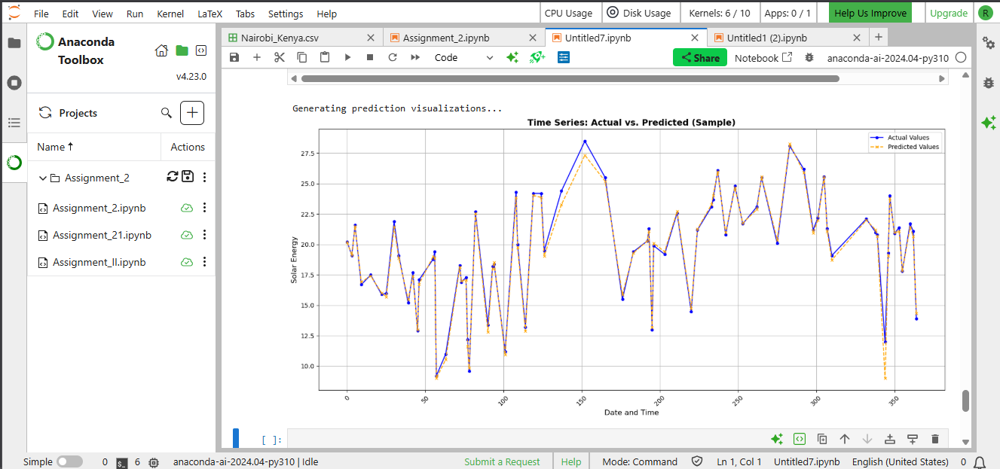

# Predicting Solar Energy Generation to Support Microgrid Planning in Africa


This project, developed for the "AI for Sustainable Development" assignment, leverages machine learning to address challenges in energy access in sub-Saharan Africa. By predicting solar energy generation based on weather data, we aim to provide a data-driven tool for planning and optimizing solar microgrids in countries like Kenya and Ghana.

## Table of Contents
* [The Problem](#the-problem)
* [Our Solution](#our-solution)
* [Project Demo](#project-demo)
* [Getting Started](#getting-started)
* [Model Evaluation](#model-evaluation)
* [Ethical Considerations](#ethical-considerations)
* [Our Team](#our-team)

## The Problem
Access to reliable and affordable electricity remains a critical challenge in rural sub-Saharan Africa. According to our research, over 600 million people lack electricity access, forcing reliance on expensive and polluting alternatives like diesel generators. While solar energy is a clean and abundant solution, its inherent variability due to weather conditions makes it difficult for energy providers and NGOs to plan and deploy effective solar infrastructure, such as microgrids.

## Our Solution
To tackle this, we have developed a **supervised machine learning model** that accurately predicts solar energy generation. Our solution uses historical weather and solar irradiance data from Nairobi, Kenya to train a powerful **XGBoost (Extreme Gradient Boosting) Regressor**.

This model can forecast solar energy output based on weather predictions, enabling stakeholders to:
-   Estimate solar farm performance with high accuracy.
-   Optimize energy storage solutions (batteries).
-   Improve the reliability and planning of off-grid energy systems.
-   Make informed, data-driven decisions for infrastructure investment.

## Project Demo
Our model's performance was evaluated through this key visualizations:

#### Prediction vs. Actual Values
This scatter plot shows the strong correlation between our model's predictions and the actual recorded solar energy values. The tight clustering around the red "Perfect Prediction" line indicates high accuracy.



## Getting Started

Follow these instructions to set up and run the project locally.

#### Prerequisites
-   Python 3.8+
-   pip (Python package installer)

#### Installation
1.  Clone the repository to your local machine:
    ```sh
    git clone https://github.com/Kaballah/PLP-AI-Assignment-Week-2.git
    cd PLP-AI-Assignment-Week-2
    ```
2.  Create a `requirements.txt` file with the following content:
    ```
    pandas
    numpy
    scikit-learn
    xgboost
    matplotlib
    seaborn
    jupyter
    ```
3.  Install the required packages:
    ```sh
    pip install -r requirements.txt
    ```

#### How to Run
The entire analysis is contained within a Jupyter Notebook. Launch it by running:
```sh
jupyter notebook Assignment_II.ipynb
```

## Model Evaluation
The XGBoost model demonstrated excellent performance on the unseen test data. The results confirm its reliability for predicting solar energy generation.

| Metric                  | Value  | Interpretation                                                  |
| ----------------------- | ------ | --------------------------------------------------------------- |
| **R-squared ($R^2$)** | 0.985  | The model explains over 98% of the variance in solar energy.    |
| **Mean Absolute Error (MAE)** | 0.158  | On average, the model's prediction is off by ~0.16 MJ/m².     |
| **Root Mean Squared Error (RMSE)** | 0.315  | A low error value, indicating a close fit to the data.      |

## Ethical Considerations

Our ethical analysis identified several key areas to ensure the responsible development and deployment of this model:
-   **Data Bias:** The current model is trained on data primarily from Nairobi, Kenya. This geographic bias means it may not be as accurate for other regions. Temporal bias could also be present if the data doesn't capture long-term climate patterns.
-   **Fairness and Equity:** To ensure fair impact, the model and its benefits should be accessible to smallholder farmers and off-grid communities, not just large utilities. Open-sourcing the model is a key step towards this.
-   **Sustainability:** By promoting efficient solar energy use, this project directly supports SDG 7 and contributes to a global reduction in carbon emissions. To maximize impact, we recommend diversifying the dataset, collaborating with local communities, and using explainability tools like SHAP or LIME to ensure model transparency.

## Our Team

This project was a collaborative effort by Group 3:

| Name      | Role                    | Github                                           |
| --------- | ----------------------- | ------------------------------------------------ |
| Ransford  | Research Lead           |   |
| Myra      | ML Engineer             |      |
| Jane      | Data Scientist          |  |
| Ronnie    | Model Developer         |    |
| Sophia    | Ethics & Impact Analyst |   |
